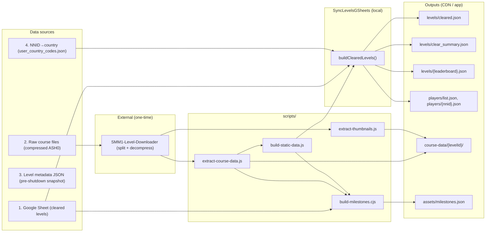

# Data pipeline

Static data is produced by scripts in `scripts/` and the **SyncLevelsGSheets** Lambda (run locally) from four main sources. The webapp fetches the resulting data from a CDN; see [constants/levelData.ts](../constants/levelData.ts) (`DATA_ROOT_URL`) and the composables/components that use it.

## Pipeline diagram



**Legend:** Sources 2–4 (and extracted course JSON) are in the [OneDrive archive](#onedrive-archive). Source 1 is the live Google Sheet. SyncLevelsGSheets joins the sheet with static level data and country codes to produce `cleared.json` and `clear_summary.json`. The level metadata JSON (3) is not consumed by SyncLevelsGSheets; [compile-level-json.js](../scripts/compile-level-json.js) can turn it into CSV for other analysis.

## Data sources (inputs)

### 1. Cleared levels Google Sheet

The source list of all levels that Team 0% cleared, maintained in a single sheet:

- **URL**: [issmmbeatenyet.com level dataset + analysis](https://docs.google.com/spreadsheets/d/1D7C_Qj7HbbnF7CiEABcr1VUPu2peQfkPfJPRr1Vuwag/edit?gid=1915966869#gid=1915966869)
- **Contents**: Level IDs, level names, upload date, who cleared each level, date the clear was registered, level stats at time of clear (stars, players, attempts, clears), creator NNID, and whether the row is a “true clear” (i.e. the original first clear was illegitimate and was re-cleared; the sheet uses a “True clear?” column).
- **Usage**: SyncLevelsGSheets downloads the “All Team 0% Clears (by clear date)” sheet via CSV and uses it as the canonical cleared-level list. [build-milestones.cjs](../scripts/build-milestones.cjs) also reads this sheet to generate milestone data.

### 2. Raw course files (compressed)

Binary course files for most levels in the sheet. Some levels were deleted before they could be archived; for those, the clear record remains in the sheet but there is no course file.

- **Origin**: Produced by the Python scripts in [`../scripts/](../scripts) that talked to Nintendo’s servers (now offline). The exact process can no longer be reproduced; the outputs are preserved in the [OneDrive archive](#onedrive-archive).
  - Some files may still be available on the Wayback Machine, but bulk download from there is effectively impossible. See link to `SMM1-Level-Downloader` below for more information.
- **Format**: Each file is a concatenation of four ASH0-compressed parts (thumbnail0, course_data, course_data_sub, thumbnail1). See [SMM1-Level-Downloader](https://github.com/snoozbuster/SMM1-Level-Downloader/blob/node/SMM1LevelDownloader.js) for the layout and splitting logic.
- **Processing**: Files must be **split** (by `ASH0` headers) and **decompressed** before use. The SMM1-Level-Downloader script does this but depends on an external Windows-only `ashextractor.exe` and is not plug-and-play. After processing you have one directory per level containing `course_data.cdt`, `course_data_sub.cdt`, `thumbnail0.tnl`, `thumbnail1.tnl`.
- **Availability**: The [OneDrive archive](#onedrive-archive) contains the original compressed files (and other Nintendo-sourced data). Extracted course-data JSON from `extract-course-data.js` is also in [that archive](#onedrive-archive) as a fallback if decompression is no longer possible.

### 3. Level metadata JSON (pre-shutdown snapshot)

One JSON file per non-deleted level with a snapshot of level metadata (plays, clears, records, upload date, etc.) from shortly before the SMM1 servers went offline.

- **Origin**: Produced by the Python scripts in [`../scripts/](../scripts) that talked to Nintendo’s servers (now offline). The exact process can no longer be reproduced; the outputs are preserved in the [OneDrive archive](#onedrive-archive).
- **Usage**: [compile-level-json.js](../scripts/compile-level-json.js) can compile a directory of these JSON files into CSV for analysis. SyncLevelsGSheets does **not** use these files directly; it uses the Google Sheet and the summarized course/static data described below.
- **Availability**: The [OneDrive archive](#onedrive-archive) contains the last known snapshots for most levels in the sheet.

### 4. NNID → country code map

A JSON map from player NNID (display name) to country code for every player referenced in the level metadata.

- **Origin**: [download-level-meta.py](../scripts/download-level-meta.py) (when servers were up) produced a mapping from internal user IDs (PIDs) to NNIDs. [pull-country-data.py](../scripts/pull-country-data.py) then fetched country information per user and built NNID → country. Both relied on Nintendo’s servers and are now defunct.
- **Availability**: The [OneDrive archive](#onedrive-archive) contains both NNID→PID and NNID→country maps; only the **NNID→country** map is used by the scripts and the site. That map is uploaded to the data bucket as `static/user_country_codes.json` for SyncLevelsGSheets to consume.

## Processing pipeline

### From raw course files to app-ready data

1. **Split and decompress** (outside this repo)  
   Use [SMM1-Level-Downloader](https://github.com/snoozbuster/SMM1-Level-Downloader) (or equivalent) to turn each compressed 4-part file into one directory per level with `course_data.cdt`, `course_data_sub.cdt`, `thumbnail0.tnl`, `thumbnail1.tnl`.

2. **Extract course data**  
   [extract-course-data.js](../scripts/extract-course-data.js) reads the `.cdt` files in each level directory (via the [viewer](../viewer/)) and writes a single course-data JSON (theme, style, timer, autoscroll, checkpoints, subworld, object summaries). This is the only source of theme/style/timer/autoscroll/etc.

   ```bash
   node ./extract-course-data.js -o=output.json -d=/path/to/level/dirs
   ```

3. **Extract thumbnails**  
   [extract-thumbnails.js](../scripts/extract-thumbnails.js) turns `.tnl` files into `.jpg` under the same level directories.

   ```bash
   node ./extract-thumbnails.js -d=/path/to/level/dirs
   ```

4. **Build static level data**  
   The raw course-data JSON from step 2 is large (~200MB). [build-static-data.js](../scripts/build-static-data.js) pares it down to a compact per-level summary (theme, style, timer, autoscroll, world length, checkpoints, subworld) consumed by SyncLevelsGSheets and the app.

   ```bash
   node ./build-static-data.js -o=output.json -i=course-data.json
   ```

The resulting **static level data JSON** is the **second input** to SyncLevelsGSheets (see below). The per-level directories (with `.cdt` and thumbnails or extracted assets) are uploaded to the CDN for the level viewer and level pages.

### SyncLevelsGSheets (build cleared dataset)

**SyncLevelsGSheets** ([`amplify/backend/function/SyncLevelsGSheets/src/`](../amplify/backend/function/SyncLevelsGSheets/src/)) is run **locally** (not deployed) to regenerate the final cleared-level dataset. It has three inputs:

| Input                  | Source                                                                                                                 | How it’s used                                                                                                                                                                                                                                                                                                                                                                                                                                          |
| ---------------------- | ---------------------------------------------------------------------------------------------------------------------- | ------------------------------------------------------------------------------------------------------------------------------------------------------------------------------------------------------------------------------------------------------------------------------------------------------------------------------------------------------------------------------------------------------------------------------------------------------ |
| **Cleared levels**     | Google Sheet “All Team 0% Clears (by clear date)”                                                                      | [buildClearedLevels.js](../amplify/backend/function/SyncLevelsGSheets/src/buildClearedLevels.js) downloads the sheet as CSV (with retries via `async-retry`), maps columns (level ID, title, creator, first clearer NNID, date cleared, stars, players, attempts, clears, “True clear?”, etc.), normalizes `hacked` as boolean, and uses this as the canonical list of cleared levels. If the CSV has fewer than 80,000 rows it throws (sanity check). |
| **Static level data**  | `static/static_level_data.json` (from [build-static-data.js](../scripts/build-static-data.js))                         | Joined by `levelId` onto each cleared row to add `autoscroll`, `theme`, `style`, `timer`, `checkpoints`, `worldLength`, and optional `subworld`. Only keys present in the static data are added; missing levels (e.g. deleted, never archived) have no theme/style/etc.                                                                                                                                                                                |
| **User country codes** | `static/user_country_codes.json` (from the pipeline that used [pull-country-data.py](../scripts/pull-country-data.py)) | Joined by `creator` and by `firstClearerNnid` to add `countryCode` and `firstClearerCountryCode` to each cleared level. Used for country-based grouping and player/creator stats.                                                                                                                                                                                                                                                                      |

Flow:

1. **buildClearedLevels()** fetches the sheet CSV (with retries) and the two JSON inputs (from S3 when not in local/dry-run mode), then left-joins static level data and country codes onto each row and sorts by `dateCleared`.
2. The handler builds a **clear summary** (clears by date, totals, legacy vs post-legacy split, daily/weekly “winners”, clears by person).
3. It uploads `levels/cleared.json` (full cleared list) and `levels/clear_summary.json` (summary).
4. **buildLeaderboards(clearedLevels)** builds clear-count leaderboards per pivot (year, month, theme, style, country, timer) and for flat sets (total, autoscroll, hacked, legacy), plus winner leaderboards (days won, streak, biggest single day). It uploads `leaderboards/list.json` with `{ clearCounts, winners }`. Leaderboard entries are trimmed to top N places or above a clear-count threshold.
5. **buildGroupings(clearedLevels, clearCountLeaderboards)** groups cleared levels by year, month, style, theme, country, and timer; uploads list + per-group JSON under `levels/year`, `levels/month`, `levels/style`, `levels/theme`, `levels/country`, `levels/timer`. Each group’s list entry includes `clearedTotal` and `leaderboardPreview` (top places for that group). It also uploads flat lists: `levels/autoscroll.json`, `levels/hacked.json`, `levels/legacy.json`, `levels/botClears.json`.
6. **uploadPlayerStats(clearedLevels)** uploads `players/list.json` (per-player cleared total, country, legacy count) and `players/{nnid}.json` (levels + stats including `clearsByDate`).

**Still commented out** (slow / optional):

- **uploadCreatorStats(clearedLevels, playerCountries)** — Same idea for creators; would upload `creators/list.json` and `creators/{nnid}.json`.

The app uses the above outputs plus the static level data and per-level assets (course-data, thumbnails) from the CDN.

<a id="onedrive-archive"></a>

## OneDrive archive

The [OneDrive archive](https://1drv.ms/u/s!At9TlyN3lZicvoFRzKH1xoc1H-0QUQ?e=eF9Jg6) (~4.5GB) holds:

- **Inputs for sources 2–4**: Raw compressed course files, level metadata JSON, and both NNID→PID and NNID→country maps. Only the **NNID→country** map is used by the scripts and the site (as `static/user_country_codes.json`).
- **Extracted course-data JSON**: Output of `extract-course-data.js`, so the site can be rebuilt even if the ability to decompress the original ASH0 files is lost.

The cleared-level **source** for source 1 is the Google Sheet linked above, not the [archive](#onedrive-archive).

## Outputs (what the app expects)

- **levels/cleared.json** — Full list of cleared levels (from SyncLevelsGSheets).
- **levels/clear_summary.json** — Summary stats (totals, clears by date, legacy, etc.).
- **levels/year/**, **levels/month/**, **levels/style/**, **levels/theme/**, **levels/country/**, **levels/timer/** — Grouped cleared levels (list.json + per-group JSON) with leaderboard previews.
- **levels/autoscroll.json**, **levels/hacked.json**, **levels/legacy.json**, **levels/botClears.json** — Flat lists of cleared levels by category.
- **leaderboards/list.json** — Clear-count leaderboards (per pivot and flat) and winner leaderboards (times, streak, biggest); see [useLeaderboards.ts](../composables/useLeaderboards.ts).
- **players/list.json**, **players/{nnid}.json** — Per-player cleared stats and level lists.
- **course-data/{levelId}/** — Per-level assets: `course_data.cdt`, `course_data_sub.cdt`, thumbnails (and/or extracted JSON/images as used by [LevelPreview.vue](../components/LevelPreview.vue), [levels/[levelId].vue](../pages/levels/[levelId].vue)).
- **uncleared.json** — List of uncleared levels (derived from cleared + full level set; see [useUnclearedLevels.ts](../composables/useUnclearedLevels.ts)).

## Other scripts

### build-milestones.cjs

[build-milestones.cjs](../scripts/build-milestones.cjs) generates clear-milestone data from:

- The cleared-levels Google Sheet (by clear date),
- The full course-data JSON from `extract-course-data.js`,
- The static level data JSON from `build-static-data.js`.

It outputs `./milestones.json` (relative to cwd). Most of [assets/milestones.json](../assets/milestones.json) comes from this script; some entries (e.g. special re-clears, autoscroll milestone) are added or edited by hand.

### convert-level-id.cjs

[convert-level-id.cjs](../scripts/convert-level-id.cjs) converts from the **internal** level ID (numeric) to the 16-digit hex **shareable** level ID (e.g. `0000-0000-02e7-c6d0`). It’s a small utility used when debugging and building the pipeline; it is not part of the main data flow.

### Python scripts (historical)

The other Python scripts in `scripts/` ([download-level-meta.py](../scripts/download-level-meta.py), [extract-pids.py](../scripts/extract-pids.py), [get-clear-list.py](../scripts/get-clear-list.py), [pull-country-data.py](../scripts/pull-country-data.py)) were used to fetch and validate data from Nintendo’s servers. Those servers are offline, so the scripts are defunct; the exact workflows are not documented here. Their outputs (or equivalents) are preserved in the [OneDrive archive](#onedrive-archive).

[scrape-clear-messages.py](../scripts/scrape-clear-messages.py) is separate: it scrapes clear-related messages (e.g. Discord) and is not part of the core pipeline above.

<a id="scripts-quick-reference"></a>

## Script reference (quick)

| Script                                     | Purpose                                                                                            |
| ------------------------------------------ | -------------------------------------------------------------------------------------------------- |
| **extract-course-data.js**                 | From level dirs with `.cdt` files → one big course-data JSON (theme, style, timer, objects, etc.). |
| **extract-thumbnails.js**                  | From `.tnl` in level dirs → `.jpg` thumbnails.                                                     |
| **build-static-data.js**                   | From course-data JSON → compact static level data JSON for SyncLevelsGSheets and app.              |
| **build-milestones.cjs**                   | From sheet + course data + static data → milestone JSON (most of assets/milestones.json).          |
| **convert-level-id.cjs**                   | Internal numeric level ID ↔ 16-digit hex level ID.                                                |
| **compile-level-json.js**                  | From directory of level metadata JSON → one CSV.                                                   |
| **download-level-meta.py**                 | (Defunct) Fetched level metadata and PID→NNID from Nintendo.                                       |
| **pull-country-data.py**                   | (Defunct) Fetched NNID→country from Nintendo.                                                      |
| **extract-pids.py**, **get-clear-list.py** | (Defunct) Extraction/validation of Nintendo data.                                                  |
| **scrape-clear-messages.py**               | Scrapes clear messages (e.g. Discord); separate from main pipeline.                                |
